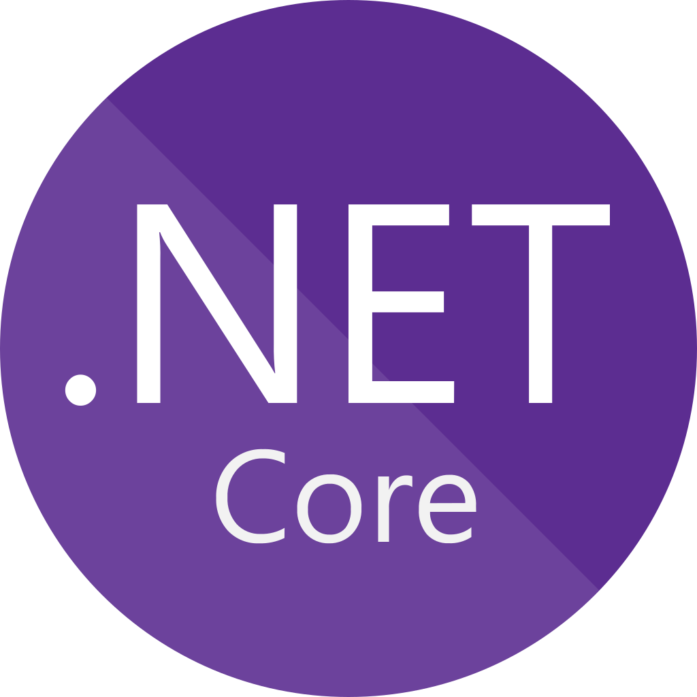

---
hide:
  - navigation
---

# Msc. Ing. Thomas Tacke - Software Engineer

## :fontawesome-solid-address-card: Kurzprofil

Leidenschaftlicher **Software Engineer / Softwarearchitekt** mit einem Master of Science (M.Sc.) in IT-Sicherheit von der **Ruhr-Universität Bochum**. Mit einem starken Fundament in angewandter Informatik und nachweislicher Erfahrung in der Konzeption und Entwicklung skalierbarer Anwendungen unter Einsatz von **Node.js**, **C#**, **Angular**, **Python** und einer **Microservices-Architektur**.

Meine Begeisterung für **neue Technologien** und **Sicherheitsthemen** treibt mich dazu, kontinuierlich innovative Lösungen zu erforschen und umzusetzen. Neben meiner beruflichen Erfahrung betreue ich aktiv private Projekte, bei denen ich **Docker** und Versionskontrollsysteme nutze, um meine Fähigkeiten in der **Systemadministration** und im Selbsthosting von Anwendungen weiterzuentwickeln.

Ich freue mich darauf, sowohl bestehende als auch neue Anwendungen als **Fullstack Engineer/Architekt** weiterzuentwickeln und mein umfassendes Verständnis von Sicherheitspraktiken in den Softwareentwicklungsprozess einzubringen.

### :fontawesome-solid-bullseye: Kontakt

:fontawesome-solid-location-dot: Im Maisel 11, 65232 Taunusstein  
:fontawesome-solid-phone: +49 178 1863598  
:fontawesome-solid-envelope: <thomas@tacke.email>  
:fontawesome-solid-globe: [https://thomas.tacke.email](https://thomas.tacke.email){target=_blank}  
:fontawesome-brands-xing: [Xing/Thomas_Tacke7](https://www.xing.com/profile/Thomas_Tacke7){target=_blank}  
:fontawesome-brands-linkedin: [LinkedIn/thomas-tacke](https://www.linkedin.com/in/thomas-tacke){target=_blank}  
:fontawesome-brands-github: [Github-Personal/ThomasTacke](https://github.com/ThomasTacke){target=_blank}  
:fontawesome-brands-github: [Github-Company-JustStats/ttacke-ops](https://github.com/ttacke-ops){target=_blank}  
:fontawesome-brands-gitlab: [GitLab/RootTheKid (Outdated, moved to GitHub)](https://gitlab.com/RootTheKid){target=_blank}  
:fontawesome-solid-file-pdf: [Diesen CV Herunterladen](pdf/document-short.pdf){target=_blank}

  <h2><i class="fa-solid fa-laptop-code"></i> Berufserfahrung</h2>
  

::timeline::

- title: Software Engineer / Softwarearchitekt<a href="https://intel.com" target="_blank">@Intel</a>
  icon: assets/intel.png
  sub_title: 2020 - Heute
  content:
    
    <i class="timeline-bullet-point fa-solid fa-arrow-right-long"></i>Migration von lokalen GitLab CI/CD-Systemen zu einer cloudbasierten GitHub-VCS-Lösung mit GitHub Actions und Jenkins, wodurch Skalierbarkeit verbessert und Wartung vereinfacht wurde.
    <i class="timeline-bullet-point fa-solid fa-arrow-right-long"></i>Entwicklung wiederverwendbarer GitHub Actions zur Standardisierung von Workflows und Steigerung der CI/CD-Effizienz.
    <i class="timeline-bullet-point fa-solid fa-arrow-right-long"></i>Verwaltung von Active Directory-Rollen zur Sicherstellung von Abteilungszugriffen und Sicherheitsrichtlinien.
    <i class="timeline-bullet-point fa-solid fa-arrow-right-long"></i>Leitung von Dokumentationsinitiativen mit DocFX und mkdocs-material zur Verbesserung des Wissensaustauschs und der Einarbeitung neuer Teammitglieder.
    <i class="timeline-bullet-point fa-solid fa-arrow-right-long"></i>Entwicklung eines Redis-basierten Publish-Subscribe-Systems in C# für Echtzeit-Kommunikation zwischen Services.
    <i class="timeline-bullet-point fa-solid fa-arrow-right-long"></i>Design einer Machine-Learning-Datenbank mit Entity Framework zur Unterstützung von prädiktiver Analyse von Testdaten.
    <i class="timeline-bullet-point fa-solid fa-arrow-right-long"></i>Erstellung von Unit-Tests in Python mit dem pytest-Framework zur Sicherstellung einer hohen Testabdeckung und Funktionalität.
    <i class="timeline-bullet-point fa-solid fa-arrow-right-long"></i>Verbesserung der CLI-Erfahrung für ein vertrauliches LLM-Projekt durch die Migration von argparse zu Python Typer.
    <i class="timeline-bullet-point fa-solid fa-arrow-right-long"></i>Entwicklung von Diensten für den automatisierten Upload von Testergebnissen zu Splunk und Jira zur Optimierung der Berichterstattung.
    

- title: Software Engineer <a href="https://intel.com" target="_blank">@Intel</a>
  icon: assets/intel.png
  sub_title: 2017 - 2020
  content:
    
    <i class="timeline-bullet-point fa-solid fa-arrow-right-long"></i>Entwicklung von Microservice-basierten Anwendungen mit NodeJS, .NET Core und Angular, Bereitstellung sowohl als Web- als auch Desktop-Anwendungen mit Electron.
    <i class="timeline-bullet-point fa-solid fa-arrow-right-long"></i>Wartung und Modernisierung von Legacy-Systemen, einschließlich eines Perl-basierten Regressionstools, und Erstellung neuer Services zur Verbesserung der Stabilität.
    <i class="timeline-bullet-point fa-solid fa-arrow-right-long"></i>Beratung zu sicheren Programmierpraktiken und Architektur, Unterstützung von Teamprojekten durch Best Practices.
    <i class="timeline-bullet-point fa-solid fa-arrow-right-long"></i>Migration von Legacy-Projekten zu einer GitLab CI/CD-Pipeline, integriert mit Kubernetes, zur Verbesserung der Skalierbarkeit.
    <i class="timeline-bullet-point fa-solid fa-arrow-right-long"></i>Betreuung und Mentoring von Werkstudenten sowie Beaufsichtigung von Bachelorarbeiten, Förderung einer kollaborativen Teamkultur.
    <i class="timeline-bullet-point fa-solid fa-arrow-right-long"></i>Erfolgreicher Übergang zur Remote-Arbeit Anfang 2020 unter Beibehaltung voller Produktivität.
    

- title: Softwareentwickler (Werkstudent) <a href="https://intel.com" target="_blank">@Intel</a>
  icon: assets/intel.png
  sub_title: 2015 - 2016
  content: 
    
    <i class="timeline-bullet-point fa-solid fa-arrow-right-long"></i>Entwicklung interner Tools zur Verbesserung von Abteilungsabläufen in Zusammenarbeit mit Senior-Entwicklern.
    <i class="timeline-bullet-point fa-solid fa-arrow-right-long"></i>Erstellung eines XML-Ende-zu-Ende-Verschlüsselungstools in Java zur Verbesserung der sicheren Datenübertragung.
    <i class="timeline-bullet-point fa-solid fa-arrow-right-long"></i>Refactoring und Wartung von Perl-basierten Legacy-Systemen zur Gewährleistung von Stabilität und Kompatibilität.
    <i class="timeline-bullet-point fa-solid fa-arrow-right-long"></i>Anwendung von Kenntnissen in Java, Perl und XML-Verschlüsselung auf praktische Entwicklungsherausforderungen, Unterstützung kontinuierlicher Code-Optimierung.
    

- title: System Administrator (Working Student) <a href="https://informatik.rub.de/syssec/" target="_blank">@Lehrstuhl für Systemsicherheit</a>
  icon: ':fontawesome-solid-graduation-cap:'
  sub_title: 2012 - 2013
  
- title: Software Entwickler (Duales Studium) <a href="https://sage.com" target="_blank">@Sage</a>
  icon: assets/sage.png
  sub_title: 2008 - 2011
  content:
    
    <i class="timeline-bullet-point fa-solid fa-arrow-right-long"></i>Unterstützte das Entwicklungsteam durch Anwendung akademischer Kenntnisse und autodidaktischen Lernens.
    <i class="timeline-bullet-point fa-solid fa-arrow-right-long"></i>Optimierte eine Business-Intelligence-Lösung durch Verbesserung der Backend-Komponenten in C# für bessere Leistung und Wartbarkeit.
    <i class="timeline-bullet-point fa-solid fa-arrow-right-long"></i>Entwickelte und erweiterte benutzerdefinierte Anwendungen für fortschrittliche Datenanalysen und Berichte.
    <i class="timeline-bullet-point fa-solid fa-arrow-right-long"></i>Zusammenarbeit mit Senior-Entwicklern und Stakeholdern zur Anforderungserhebung und Umsetzung maßgeschneiderter Lösungen.
    

- title: Zivildienst @General Hospital Hamelin
  icon: ':fontawesome-solid-hospital:'
  sub_title: 2007 - 2008
  
::/timeline::

  

  

  

  <h2 markdown="1"><i class="fa-solid fa-building-columns"></i> Bildung</h2>

::timeline::

-   title: Master of Science - IT Sicherheit <a href="https://informatik.rub.de/studium/its/" target="_blank">@Ruhr Universität Bochum</a>
    icon: ':fontawesome-solid-graduation-cap:'
    sub_title: 2011 - 2016

- title: Bachelor of Science - Angewandte Informatik <a href="https://www.mannheim.dhbw.de/studium/bachelor/technik/informatik/angewandte-informatik" target="_blank">@Duale Hochschule Baden-Württemberg</a>
  icon: ':fontawesome-solid-graduation-cap:'
  sub_title: 2008 - 2011

- title: Allgemeine Hochschulreife - Informatik <a href="https://www.ers-hameln.de/unser-angebot/bildungsgaenge/fachoberschulen/technik/FOT11_FOT12.html" target="_blank">@Eugen-Reintjes-Schule</a>
  icon: ':fontawesome-solid-graduation-cap:'
  sub_title: 2004 - 2007

::/timeline::
  

  

  <h3 markdown="1">:fontawesome-solid-language: Sprachen</h3>

| Sprache  | Skill-Level                  |
| -------- | ---------------------------- |
| Deutsch  | Muttersprache                |
| Englisch | Fließend in Wort und Schrift |

  

  

<h2 markdown="1">:fontawesome-brands-free-code-camp: Programmierkenntnisse</h2>

  
C# Programming

  
 C#

  

  
  ASP.NET Core

  

  
  Entity Framework

  

  
Python Programming

  
<i class="fa-brands fa-python"></i>  Python

  

  
  FastAPI

  

  
  Pydantic

  

  
  Typer

  

TypeScript Programming

  
 TypeScript

  

  
<i class="fa-brands fa-2x fa-node"></i>  NodeJS

  

  
  fastify

  

  
<i class="fa-brands fa-angular"></i>  Angular

  

<h2 markdown="1">:fontawesome-brands-free-code-camp: Fähigkeiten</h2>

  
Markup Languages

  
<i class="fa-brands fa-html5"></i><i class="fa-brands fa-css3"></i>  HTML5/CSS3

  

  
<i class="fa-brands fa-markdown"></i>  Markdown

  

  
DevOps

  
<i class="fa-brands fa-docker"></i>  Docker

  

  
<i class="fa-brands fa-square-github"></i>  Github/Github Actions

  

  
  Rancher/Kubernetes

  

  
IT-Sec

  
<i class="fa-solid fa-network-wired"></i>  Network Analysis

  

  
<i class="fa-brands fa-hive"></i>  Cryptography

  

  
<i class="fa-solid fa-shield-cat"></i>  Protocol Security

  

<h2 markdown="1">:fontawesome-solid-book: Veröffentlichungen</h2>
!!! abstract "Bachelorarbeit – Entwicklung und Implementierung eines sicheren WLAN-Konzepts"

    Diese Arbeit konzentriert sich auf die Entwicklung und Implementierung einer **sicheren WLAN**-Lösung für mehrere Einrichtungen. Verschiedene **Verschlüsselungstechniken** sowie **Authentifizierungs- und Autorisierungsmechanismen** wurden analysiert, um den effektivsten Ansatz zur Sicherung des Netzwerks zu bestimmen. Nach der Ausarbeitung des Sicherheitskonzepts für das WLAN wurde ein **Pilotprojekt** in einer ausgewählten Einrichtung durchgeführt, bei dem die Lösung implementiert und anhand umfassender **Leistungstests** evaluiert wurde.

!!! abstract "Masterarbeit – Analyse, Implementierung und Optimierung eines End-to-End-Sicherheitskonzepts für das Internet der Dinge in einem Industrie-4.0-Szenario"

    Diese Arbeit untersucht die sichere Kommunikation in Industrie-4.0-Umgebungen, in denen Geräte über unsichere Kanäle wie Mobilfunknetze kommunizieren. Es wurden End-to-End-Verschlüsselungsmethoden für ressourcenbeschränkte IoT-Geräte entwickelt und evaluiert, unter Verwendung von Protokollen wie CoAP, MQTT und WebSocket. Die Implementierung erfolgte auf dem Quark™ SE Mikrocontroller von Intel. Die Ergebnisse zeigten, dass End-to-End-Verschlüsselung ohne erhebliche Leistungseinbußen möglich ist, jedoch bei hoher Teilnehmerzahl Skalierungsprobleme durch Kommunikations- und Rechenaufwand auftreten.

